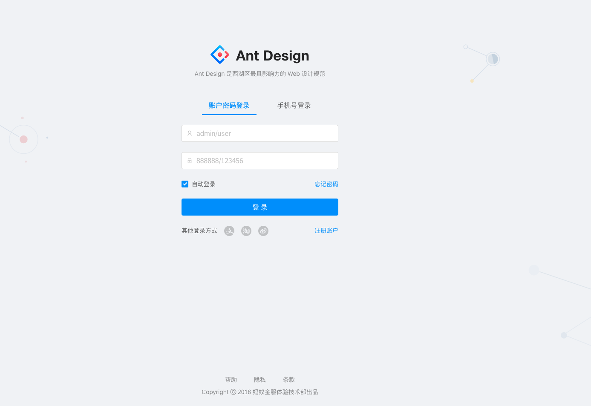

# 认证

## 注册

* 支持手机号码+验证码注册
* 支持用户名+密码注册

## 登录

* 支持手机号码+验证码登录
* 支持用户名+密码登录

## API

登录接口:

* 路径: `/auth/login`
* 方法: POST
* 参数:
  * `username` 登录用户名
  * `password` 密码
  * `type` 登录类型。 `account` 账户名+密码; `phone` 手机+验证码
* 返回: 200, `{data: {token}}`

登录接口:

* 路径: `/auth/register`
* 方法: POST
* 参数:
  * `username` 登录用户名
  * `password` 密码
  * `type` 注册类型。 `account` 账户名+密码; `phone` 手机+验证码
* 返回: 201, `{data: {id, username, ...}}`

## 参考

