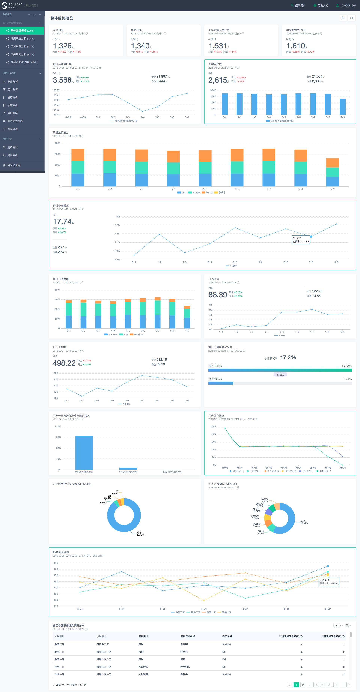

# 数据概览

这部分图表需求会比较多，请尽量以组件的形式去实现，这样很多图表可以复用，也易于维护。

交互方面，请多参考神策数据 demo, [地址](https://www.sensorsdata.cn/demo/demo.html)

因为游戏目前没有上线，所以也没有数据产生。所以前期实现，请在客户端 mock 数据。

## 整体数据概览

* 可通过日期查询不同指标
* 前期需要实现 UI 展现组件
* 参考地址: [链接](https://gamedemo.cloud.sensorsdata.cn/dashboard/?project=default&oauth_type=oauth&code=sITMIl_bGyNlUZT1ZXb-qRK3JbfaWtP4oYTOb0t4U1398dRlf_oRKrJ8XsYzN7mrOdc8KXuOSc-fYyuM8maHdkWE_HZo-2Ec6eHOat1Q7e4&status=#dashid=1)
* 截图: 

## 消费系统分析

* 参考地址: [链接](https://gamedemo.cloud.sensorsdata.cn/dashboard/?project=default&oauth_type=oauth&code=sITMIl_bGyNlUZT1ZXb-qRK3JbfaWtP4oYTOb0t4U1398dRlf_oRKrJ8XsYzN7mrOdc8KXuOSc-fYyuM8maHdkWE_HZo-2Ec6eHOat1Q7e4&status=#dashid=2)

* 截图: 

## 任务活动分析

* 参考地址: [链接](https://gamedemo.cloud.sensorsdata.cn/dashboard/?project=default&oauth_type=oauth&code=sITMIl_bGyNlUZT1ZXb-qRK3JbfaWtP4oYTOb0t4U1398dRlf_oRKrJ8XsYzN7mrOdc8KXuOSc-fYyuM8maHdkWE_HZo-2Ec6eHOat1Q7e4&status=#dashid=4)

* 截图: 

## 网站基础指标

* 参考地址: [链接](https://ebizdemo.cloud.sensorsdata.cn/dashboard/?project=default#dashid=3)

* 截图: 

## 渠道分析

* 参考地址: [链接](https://financedemo.cloud.sensorsdata.cn/dashboard/?project=default&oauth_type=oauth&code=sITMIl_bGyNlUZT1ZXb-qRK3JbfaWtP4oYTOb0t4U1398dRlf_oRKrJ8XsYzN7mr2WkYS2geek_MX_4GciZ73mWllQl6_i15auIhZTD9Ifc&status=#dashid=11)
* 截图: 

## 运营分析

* 参考地址: [链接](https://financedemo.cloud.sensorsdata.cn/dashboard/?project=default&oauth_type=oauth&code=sITMIl_bGyNlUZT1ZXb-qRK3JbfaWtP4oYTOb0t4U1398dRlf_oRKrJ8XsYzN7mr2WkYS2geek_MX_4GciZ73mWllQl6_i15auIhZTD9Ifc&status=#dashid=12)
* 截图: 

## 实时数据概览

实时数据拉取，在客户端定时轮询即可。

* 参考地址: [链接](http://mta.qq.com/mta/overview/ctr_single_app?app_id=1&event_id=Buy)
* 截图: 
