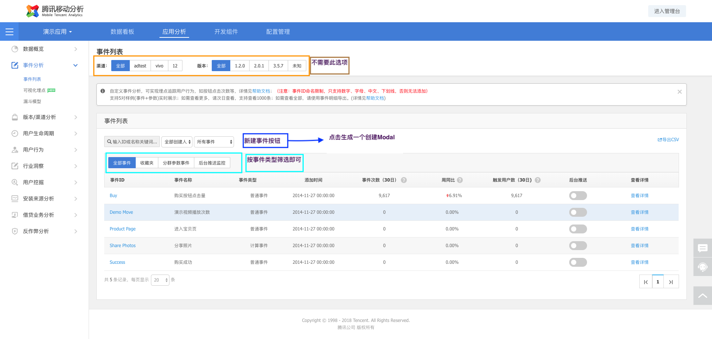
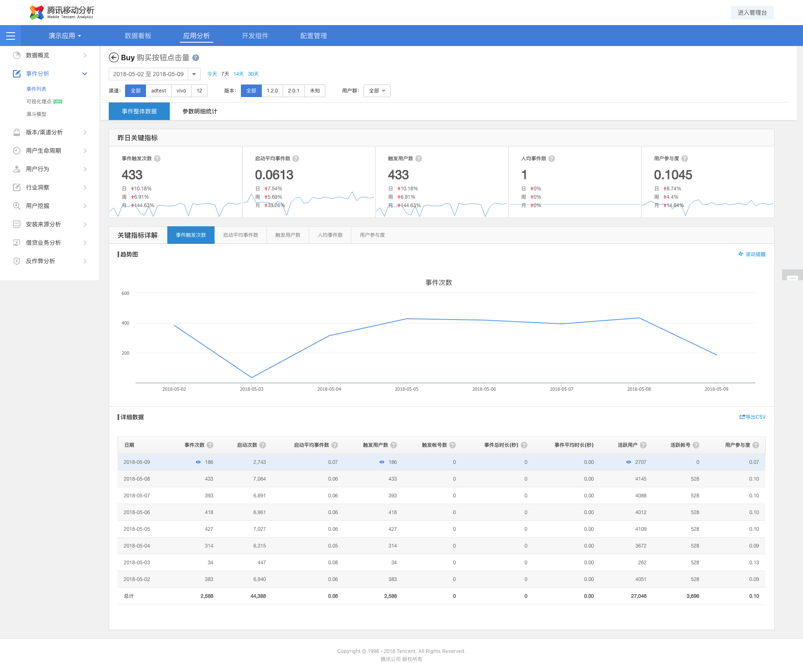

# 事件分析

* 功能需求：

- 事件 Event model 的 CRUD 操作

## 事件列表

* 实现参考: [链接](http://mta.qq.com/mta/custom/ctr_event_conf?app_id=1&event_id=Buy)
* 截图: 

## 事件查询

* 实现参考: [链接](http://mta.qq.com/mta/custom/ctr_event_occur?app_id=1&event_id=Buy&isStoreKv=-1)
* 截图: 
