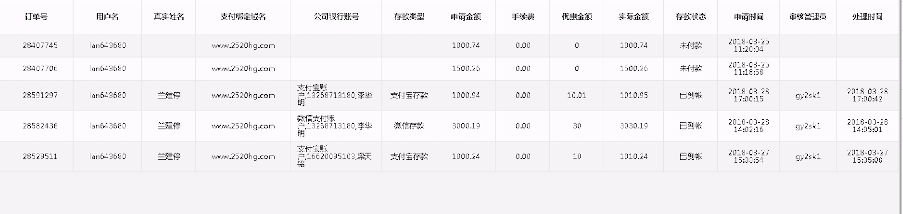

# 充值管理

* 查询表单组件+结果列表的形式

参考:

| ID     | 用户名 | 真实姓名 | 订单号       | 公司收款账号 | 支付渠道 | 支付方式 | 金额   | 手续费 | 入账金额 | 状态     | 创建时间            | 支付时间            | 支付成功 | 是否首冲 | 审核管理员 | 处理时间 | 操作                |
| ------ | ------ | -------- | ------------ | ------------ | -------- | -------- | ------ | ------ | -------- | -------- | ------------------- | ------------------- | -------- | -------- | ---------- | -------- | ------------------- |
| 288282 | aqi888 | 王刚     | 201728819001 | 28823882020  | 支付宝   | wap_scan | 100.00 | 0      | 100.00   | 支付成功 | 2017-08-30 10:38:20 | 2018-08-22 10:40:20 | 成功     | 是       |            |          | 刷新 , 最近支付记录 |
| 288282 | aqi888 | 王刚     | 201728819001 | 28823882020  | 支付宝   | wap_scan | 100.00 | 0      | 0.00     | 超时     |                     |                     | 失败     | 否       |            |          | 刷新 , 最近支付记录 |
| 288282 | aqi888 | 王刚     | 201728819001 | 28823882020  | 银行汇款 | wap_scan | 100.00 | 0      | 0.00     | 超时     |                     |                     | 失败     | 否       |            |          | 刷新 , 最近支付记录 |

## 属性字段

* `id`: int id
* `user_id`: int 用户 ID
* `client_ip`: str IP
* `channel`: str 充值渠道 alipay, wechat, jdpay
* `method`: str 充值方式: alipay_scan, wx_scan
* `subject`: str 商品名称
* `charge_id`: int 支付凭证 ID
* `charge`: object 支付凭证对象
* `order_no`: str 订单号
* `amount`: int 金额（以分为单位）
* `user_fee`: int 手续费（以分为单位）
* `balance_bonus`: int 充值赠送金额（以分为单位）
* `promotion`: str 参与优惠活动内容
* `credits`: int 赠送积分
* `succeeded`: bool 是否成功
* `time_succeeded`: datetime 订单完成时间
* `description`: str 订单内容
* `mtdata`: object 订单元数据
* `status`: str 订单状态 `pending` 待处理, `paid` 完成, `expired` 超时

## API

列表|搜索:

按 `id`，`user_id`, `channel`, `charge_id` 进行查找

按金额范围，创建时间，更新时间进行范围查找

* 接口地址: `/api/recharges`
* 方法: `GET`
* 参数: `{per_page, page, }`: per_page 每页数目， page: 第 N 页
* 返回: 200, `{data: {meta: {first, last, page, per_page, next_page, prev_page, total, pages}}, items: [{id1,...},{id2,...}]}}`

创建:

* 接口地址: `/api/recharges`
* 方法: `POST`
* 参数: `{, ...}`
* 返回: 201, `{data: {id, , ...}}`

详细信息:

* 接口地址: `/api/recharges/<id>`
* 方法: `GET`
* 参数:
* 返回: 200, `{data: {id, ...}}`

修改:

* 接口地址: `/api/recharges/<id>`
* 方法: `PUT|POST`
* 参数: `{...}`
* 返回: 200, `{data: {id, ...}}`

删除:

* 接口地址: `/api/recharges/<id>`
* 方法: `DELETE`
* 参数:
* 返回: 200
