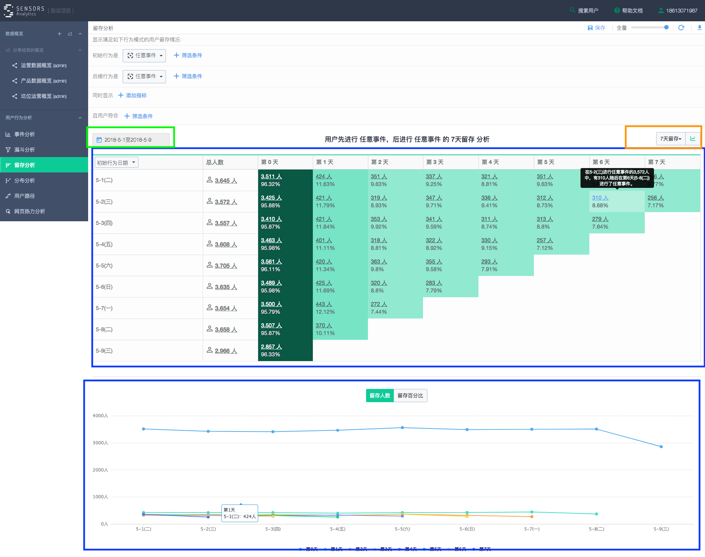

# 留存分析

* 可根据时间查询用户的留存数据
* [参考地址](https://ebizdemo.cloud.sensorsdata.cn/retention/?project=default#rangeText=%E6%9C%AC%E6%9C%88&from_date=2018-05-01&to_date=2018-05-09&extend_over_end_date=true&duration=7&unit=day&chartsType=raw&sampling_factor=64&first_event%5Bevent_name%5D=%24Anything&second_event%5Bevent_name%5D=%24Anything&is_wastage=false)
* 截图参考: 
