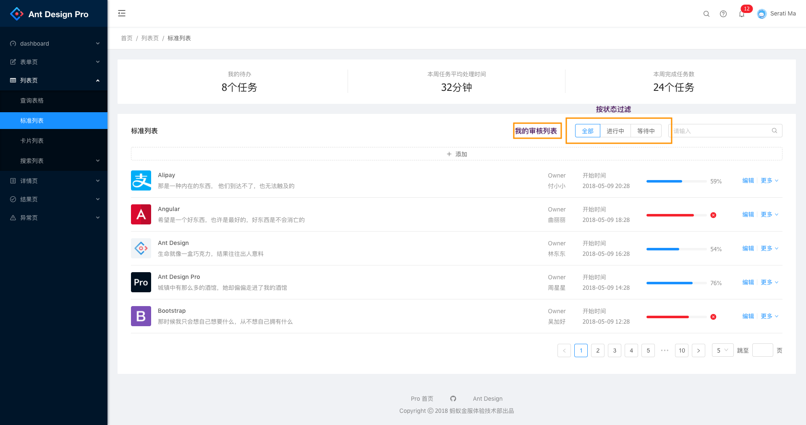

# 审核列表

业务操作:

* 认领
* 通过|拒绝 -> 点击通过或者拒绝都要弹出 modal 填写原因

列表过滤:

* 我的审核列表
* 按状态

支持搜索:

## 审核列表

* 截图参考 

| ID  | 申请人 | 类型 | 状态   | 内容     | 申请时间            | 处理时间            | 审核人 | 元数据 | 备注             | 操作                 |
| --- | ------ | ---- | ------ | -------- | ------------------- | ------------------- | ------ | ------ | ---------------- | -------------------- |
| 1   | 老李   | 提现 | 待处理 | 提现 200 | 2018-08-10 20:33:10 |                     |        |        |                  | 认领,通过,拒绝，备注 |
| 2   | 老李   | 提现 | 已通过 | 提现 200 | 2018-08-10 20:33:10 | 2018-08-10 20:33:10 | 小李   |        | 准许             | 认领,通过,拒绝，备注 |
| 3   | 老李   | 提现 | 拒绝   | 提现 200 | 2018-08-10 20:33:10 | 2018-08-10 20:33:10 | 小 A   |        | 提现次数太过频繁 | 认领,通过,拒绝，备注 |

## 属性字段

* `id`: int ID
* `user_id`: int 申请人 ID
* `owner_id`: int 审核负责人 ID
* `type`: str 审核类型
* `title`: str 审核标题
* `description`: str 审核内容
* `status`: status 状态: `pending`, `approved`, `denied`, `processing`
* `remark`: str 备注
* `extra`: json 额外参数
* `mtdata`: json 元数据

## API

列表|搜索:

* 接口地址: `/api/reviews`
* 方法: `GET`
* 参数: `{per_page, page, q}`: per_page 每页数目， page: 第 N 页， q: 搜索关键字
* 返回: 200, `{data: {meta: {first, last, page, per_page, next_page, prev_page, total, pages}}, items: [{id1,...},{id2,...}]}}`

创建:

* 接口地址: `/api/reviews`
* 方法: `POST`
* 参数: `{, ...}`
* 返回: 201, `{data: {id, ...}}`

详细信息:

* 接口地址: `/api/reviews/<id>`
* 方法: `GET`
* 参数:
* 返回: 200, `{data: {id, ...}}`

修改:

* 接口地址: `/api/reviews/<id>`
* 方法: `PUT|POST`
* 参数: `{...}`
* 返回: 200, `{data: {id, ...}}`

认领审核任务:

* 接口地址: `/api/reviews/<id>/claim`
* 方法: `POST`
* 参数: `{owner_id: id}`
* 返回: 200, `{data: {id, ...}}`

分配审核任务:

* 接口地址: `/api/reviews/<id>/claim`
* 方法: `POST`
* 参数: `{owner_id: id}`
* 返回: 200, `{data: {id, ...}}`

审核通过任务

* 接口地址: `/api/reviews/<id>/approve`
* 方法: `POST`
* 参数: `{remark}`
* 返回: 200, `{data: {id, ...}}`

审核拒绝任务

* 接口地址: `/api/reviews/<id>/denny`
* 方法: `POST`
* 参数: `{remark}`
* 返回: 200, `{data: {id, ...}}`

备注审核任务

* 接口地址: `/api/reviews/<id>/remark`
* 方法: `POST`
* 参数: `{remark}`
* 返回: 200, `{data: {id, ...}}`

删除:

* 接口地址: `/api/users/<user_id>`
* 方法: `DELETE`
* 参数:
* 返回: 200
