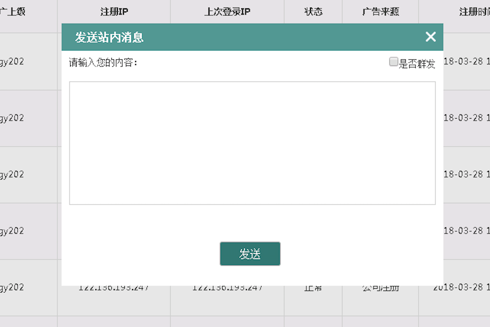

# 用户查询

* 用户 model 的 CRUD, 一些业务操作，比如禁用，删除, 设置密码，发送消息
* 标准查询列表， 由一个查询表单加一个列表组件组成
* 支持自定义数据列显示（可以显示关闭部分 model 字段）

- [参考](https://preview.pro.ant.design/#/list/table-list)

* 

## 用户管理

### 支持的操作

* 查看余额
* 发送短信
* 冻结账户
* 查看/编辑用户资料
* 查看/编辑用户银行资料
* 升级代理
* 拨号

- 

### 编辑用户资料

* 

### 发送站内消息

* 

### 编辑查看银行卡资料

* 

### 升级代理

* 

## 属性字段

* `id`: int 用户 ID
* `username`: str 登录名
* `nickname`: str 昵称
* `birthday`: datetime 生日
* `gender`: int 0 为男性，1 为女性
* `avatar`: str 头像链接
* `referrer_id`: int 推荐人 ID
* `referrals_num`: int 用户下线人数
* `channel`: str 来源渠道
* `phone`: str 手机号码
* `idcard`: str 身份证
* `real_name`: str 真实姓名
* `email`: str email
* `qq`: str qq
* `wechat`: str 微信号
* `address`: str 住址
* `is_active`: bool 是否禁用
* `is_guest`: bool 是否游客
* `is_staff`: bool 是否职员
* `is_agent`: bool 是否代理
* `is_admin`: bool 是否管理员
* `is_online`: bool 是否在线
* `phone_confirmed`: bool 绑定手机
* `email_confirmed`: bool email 绑定
* `ident_confirmed`: bool 实名认证
* `card_confirmed`: bool 绑定银行卡
* `register_ip`: str 注册 IP
* `register_at`: datetime 注册于
* `last_seen`: datetime 最后活跃于
* `last_login_at`: datetime 最后登录的时间
* `current_login_at`: datetime 当前登录的时间
* `current_login_ip`: str 当前登录 IP
* `login_count`: str 登录次数
* `role`: str 角色名

## API

列表|搜索:

* 接口地址: `/api/reviews`
* 方法: `GET`
* 参数: `{per_page, page, q}`: per_page 每页数目， page: 第 N 页， q: 搜索关键字
* 返回: 200, `{data: {meta: {first, last, page, per_page, next_page, prev_page, total, pages}}, items: [{id1,...},{id2,...}]}}`

创建:

* 接口地址: `/api/users`
* 方法: `POST`
* 参数: `{username, password, ...}`
* 返回: 201, `{data: {id, username, ...}}`

详细信息:

* 接口地址: `/api/users/<user_id>`
* 方法: `GET`
* 参数:
* 返回: 200, `{data: {id, username, ...}}`

修改:

* 接口地址: `/api/users/<user_id>`
* 方法: `PUT|POST`
* 参数: `{real_name, ...}`
* 返回: 200, `{data: {id, username, ...}}`

修改密码:

* 接口地址: `/api/users/<user_id>/set_password`
* 方法: `PUT|POST`
* 参数:
* 返回: 200, `{data: {id, username, ...}}`

删除:

* 接口地址: `/api/users/<user_id>`
* 方法: `DELETE`
* 参数:
* 返回: 200
